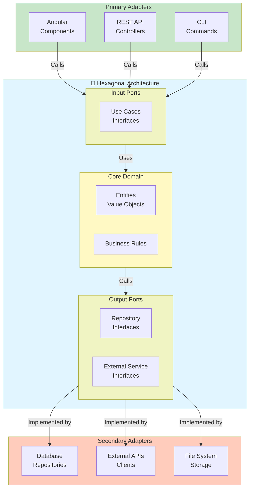
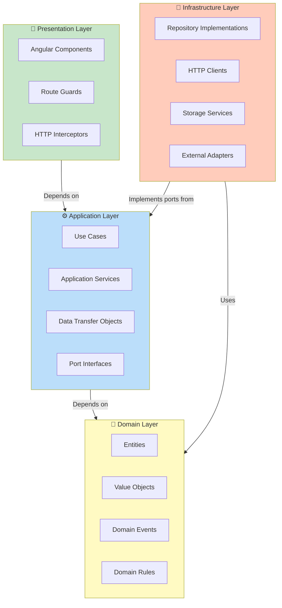
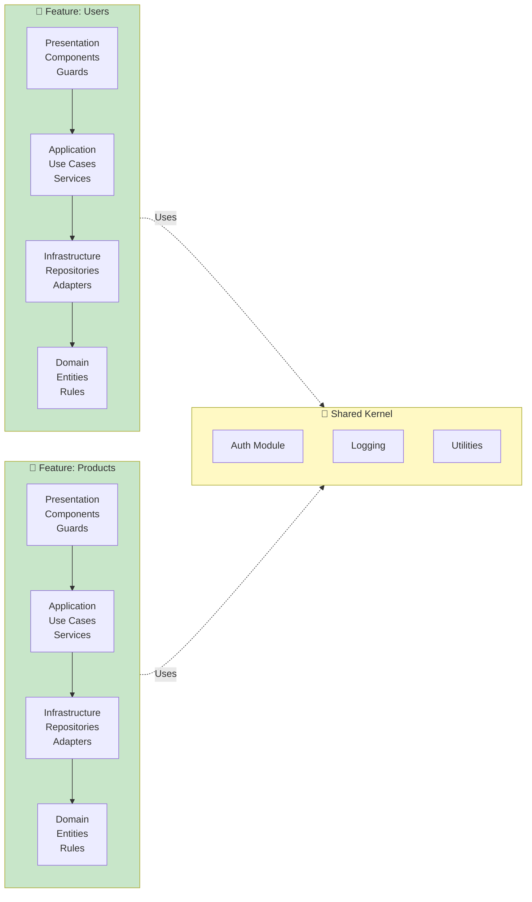
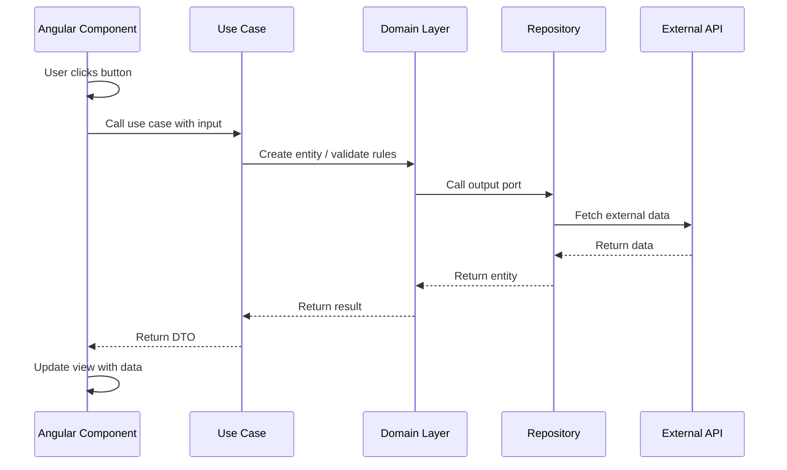

# Architecture Guide

This document describes the architecture of the project, combining **Hexagonal Architecture (Ports and Adapters)**, **Clean Architecture**, and **Vertical Slicing**. Use this guide to understand the structure, patterns, and conventions that guide development.

## Table of Contents

1. [Overview](#overview)
2. [Hexagonal Architecture](#hexagonal-architecture)
3. [Clean Architecture Layers](#clean-architecture-layers)
4. [Vertical Slicing Organization](#vertical-slicing-organization)
5. [Data Flow](#data-flow)
6. [Dependency Rules](#dependency-rules)
7. [Code Examples](#code-examples)
8. [Naming Conventions](#naming-conventions)
9. [Folder Structure](#folder-structure)
10. [Dependency Matrix](#dependency-matrix)
11. [FAQ](#faq)

---

## Overview

The architecture combines three complementary patterns:

- **Hexagonal Architecture**: Isolates the core domain from external concerns via ports and adapters
- **Clean Architecture**: Organizes code into layers with strict dependency rules
- **Vertical Slicing**: Groups features with all their layers in self-contained modules

This approach ensures:
- High testability (domain logic is framework-independent)
- Clear separation of concerns
- Parallel feature development
- Easy refactoring and evolution

---

## Hexagonal Architecture

Hexagonal Architecture separates the core domain from external systems through clearly defined interfaces (ports) and implementations (adapters).

### Hexagonal Architecture Diagram



### Components

**Core Domain** (Yellow)
- Pure business logic with no external dependencies
- Entities: Objects with identity (User, Product, Order)
- Value Objects: Objects without identity (Money, Email, Address)
- Domain Rules: Pure functions implementing business logic

**Input Ports** (Light Green)
- Interfaces for use cases
- Define how the domain can be used
- Implemented by Application layer

**Output Ports** (Light Green)
- Interfaces for external dependencies
- Define contracts for repositories and external services
- Implemented by Infrastructure layer

**Primary Adapters** (Green)
- Drive the application (UI, API, CLI)
- Translate user input to domain actions
- Examples: Angular components, REST endpoints

**Secondary Adapters** (Orange)
- Driven by the application (Database, APIs, File System)
- Implement output port interfaces
- Handle external communication

---

## Clean Architecture Layers

Clean Architecture organizes code into layers with strict dependency rules. All dependencies point inward toward the domain.

### Clean Architecture Layers Diagram



### Layer Responsibilities

**Domain Layer** 💎 (Yellow - Innermost)
- Pure business logic with no external dependencies
- Entities, Value Objects, Domain Events, Domain Rules
- Types: `.entity.ts`, `.value-object.ts`, `.type.ts`
- Example: `User.entity.ts`, `Email.value-object.ts`

**Application Layer** ⚙️ (Blue)
- Orchestrates the domain for specific use cases
- Use Cases, Application Services, DTOs, Port Interfaces
- Types: `.use-case.ts`, `.service.ts`, `.port.ts`, `.dto.ts`
- Example: `CreateUserUseCase`, `UserRepository.port.ts`

**Infrastructure Layer** 🔌 (Orange)
- Implements application ports
- Repository implementations, HTTP clients, storage adapters
- Types: `.repository.ts`, `.client.ts`, `.adapter.ts`
- Example: `FirebaseUserRepository`, `JsonPlaceholderClient`

**Presentation Layer** 📱 (Green - Outermost)
- User-facing interfaces (Angular components)
- Routes, guards, interceptors, components
- Calls use cases but never accesses infrastructure directly
- Example: `UserFormComponent`, `AuthGuard`

---

## Vertical Slicing Organization

Vertical Slicing organizes features with all their layers together in self-contained modules. Each feature is a complete vertical slice.

### Vertical Slicing Diagram



### Benefits

- **Modularity**: Each feature is self-contained
- **Parallel Development**: Teams can work on different features independently
- **Clarity**: It's clear which files belong to which feature
- **Scalability**: Easy to add new features without affecting existing ones
- **Reusability**: Shared kernel contains cross-cutting concerns

### Structure Example

```
src/
├── features/
│   ├── users/                    # Feature: Users
│   │   ├── presentation/
│   │   │   ├── components/
│   │   │   ├── guards/
│   │   │   └── user.routes.ts
│   │   ├── application/
│   │   │   ├── use-cases/
│   │   │   ├── services/
│   │   │   ├── dtos/
│   │   │   └── ports/
│   │   ├── infrastructure/
│   │   │   ├── repositories/
│   │   │   └── adapters/
│   │   └── domain/
│   │       ├── entities/
│   │       ├── value-objects/
│   │       └── types/
│   ├── products/                 # Feature: Products
│   │   └── [same structure]
│   └── orders/                   # Feature: Orders
│       └── [same structure]
├── shared/                        # Shared Kernel
│   ├── auth/
│   ├── logging/
│   ├── utils/
│   └── types/
└── main.ts
```

---

## Data Flow

This diagram shows how a typical request flows through the architecture from presentation to domain and back.

### Data Flow Diagram



### Flow Steps

1. **Presentation**: User interaction triggers a component
2. **Application**: Component calls a use case with input data
3. **Domain**: Use case executes domain logic and validates rules
4. **Infrastructure**: Domain queries repositories through output ports
5. **External**: Infrastructure fetches data from external services
6. **Return Path**: Data flows back through layers as DTOs

---

## Dependency Rules

These rules ensure the architecture remains clean and scalable.

### Rule 1: Domain Has No Dependencies

The Domain layer must NOT depend on any other layer.

```
Domain ❌ depends on anything
Domain ✅ is depended on by everything
```

### Rule 2: Application Depends Only on Domain

The Application layer implements domain use cases and must NOT depend on Infrastructure or Presentation.

```
Application ✅ depends on Domain
Application ❌ depends on Infrastructure
Application ❌ depends on Presentation
```

### Rule 3: Infrastructure Implements Application Ports

The Infrastructure layer implements the port interfaces defined by Application layer.

```
Infrastructure ✅ implements Ports from Application
Infrastructure ✅ depends on Domain
Infrastructure ❌ depends on Presentation (usually)
```

### Rule 4: Presentation Depends on Application Only

The Presentation layer uses Application services/use cases but NEVER accesses Infrastructure directly.

```
Presentation ✅ depends on Application
Presentation ✅ can depend on Domain types (read-only)
Presentation ❌ depends on Infrastructure
```

### Rule 5: Shared Kernel is Dependency-Free

Shared code (utilities, logging, auth) must NOT depend on any feature layer.

```
Shared ✅ is used by all features
Shared ❌ depends on specific features
```

---

## Code Examples

### Domain Layer

#### Entity Example

```typescript
// src/features/users/domain/entities/user.entity.ts

export interface IEntity {
  id: string;
  createdAt: Date;
}

export class User implements IEntity {
  id: string;
  createdAt: Date;
  
  constructor(
    id: string,
    public email: string,
    public name: string,
    public role: 'admin' | 'user',
    createdAt: Date = new Date()
  ) {
    this.id = id;
    this.createdAt = createdAt;
    this.validateEmail();
  }
  
  private validateEmail(): void {
    if (!this.email.includes('@')) {
      throw new Error('Invalid email format');
    }
  }
  
  changeEmail(newEmail: string): void {
    this.validateEmail(); // Validates email format
    this.email = newEmail;
  }
  
  isAdmin(): boolean {
    return this.role === 'admin';
  }
}
```

#### Value Object Example

```typescript
// src/features/users/domain/value-objects/email.value-object.ts

export class Email {
  private readonly value: string;
  
  constructor(email: string) {
    if (!this.isValid(email)) {
      throw new Error(`Invalid email: ${email}`);
    }
    this.value = email;
  }
  
  private isValid(email: string): boolean {
    const emailRegex = /^[^\s@]+@[^\s@]+\.[^\s@]+$/;
    return emailRegex.test(email);
  }
  
  getValue(): string {
    return this.value;
  }
  
  equals(other: Email): boolean {
    return this.value === other.getValue();
  }
}
```

### Application Layer

#### Use Case Example

```typescript
// src/features/users/application/use-cases/create-user.use-case.ts

import { Injectable } from '@angular/core';
import { User } from '../../domain/entities/user.entity';
import { UserRepositoryPort } from '../ports/user-repository.port';
import { CreateUserDto } from '../dtos/create-user.dto';

@Injectable()
export class CreateUserUseCase {
  constructor(private userRepository: UserRepositoryPort) {}
  
  async execute(dto: CreateUserDto): Promise<User> {
    // Validate business rules
    const existingUser = await this.userRepository.findByEmail(dto.email);
    if (existingUser) {
      throw new Error('User with this email already exists');
    }
    
    // Create domain entity
    const user = new User(
      this.generateId(),
      dto.email,
      dto.name,
      'user'
    );
    
    // Persist using repository port
    return this.userRepository.save(user);
  }
  
  private generateId(): string {
    return `user_${Date.now()}`;
  }
}
```

#### Repository Port Interface

```typescript
// src/features/users/application/ports/user-repository.port.ts

import { InjectionToken } from '@angular/core';
import { User } from '../../domain/entities/user.entity';

export const USER_REPOSITORY_PORT = new InjectionToken<UserRepositoryPort>(
  'UserRepositoryPort'
);

export interface UserRepositoryPort {
  save(user: User): Promise<User>;
  findById(id: string): Promise<User | null>;
  findByEmail(email: string): Promise<User | null>;
  update(user: User): Promise<User>;
  delete(id: string): Promise<void>;
}
```

### Infrastructure Layer

#### Repository Implementation

```typescript
// src/features/users/infrastructure/repositories/firebase-user.repository.ts

import { Injectable } from '@angular/core';
import { User } from '../../domain/entities/user.entity';
import { UserRepositoryPort } from '../../application/ports/user-repository.port';
import { FirebaseService } from '../../../shared/firebase/firebase.service';

@Injectable()
export class FirebaseUserRepository implements UserRepositoryPort {
  private collection = 'users';
  
  constructor(private firebase: FirebaseService) {}
  
  async save(user: User): Promise<User> {
    const doc = await this.firebase.add(this.collection, {
      email: user.email,
      name: user.name,
      role: user.role,
      createdAt: user.createdAt.toISOString(),
    });
    
    user.id = doc.id;
    return user;
  }
  
  async findById(id: string): Promise<User | null> {
    const doc = await this.firebase.getDoc(this.collection, id);
    if (!doc) return null;
    
    return new User(
      id,
      doc.email,
      doc.name,
      doc.role,
      new Date(doc.createdAt)
    );
  }
  
  async findByEmail(email: string): Promise<User | null> {
    const docs = await this.firebase.query(
      this.collection,
      'email',
      '==',
      email
    );
    
    if (docs.length === 0) return null;
    
    const doc = docs[0];
    return new User(
      doc.id,
      doc.email,
      doc.name,
      doc.role,
      new Date(doc.createdAt)
    );
  }
  
  async update(user: User): Promise<User> {
    await this.firebase.update(this.collection, user.id, {
      email: user.email,
      name: user.name,
      role: user.role,
    });
    return user;
  }
  
  async delete(id: string): Promise<void> {
    await this.firebase.delete(this.collection, id);
  }
}
```

### Presentation Layer

#### Angular Component with Signals

```typescript
// src/features/users/presentation/components/user-form/user-form.component.ts

import { Component, signal, computed, inject } from '@angular/core';
import { FormsModule } from '@angular/forms';
import { CommonModule } from '@angular/common';
import { CreateUserUseCase } from '../../application/use-cases/create-user.use-case';
import { CreateUserDto } from '../../application/dtos/create-user.dto';

@Component({
  selector: 'app-user-form',
  standalone: true,
  imports: [CommonModule, FormsModule],
  template: `
    <form (ngSubmit)="onSubmit()">
      <input
        type="email"
        [(ngModel)]="email"
        placeholder="Email"
        [disabled]="isLoading()"
      />
      <input
        type="text"
        [(ngModel)]="name"
        placeholder="Name"
        [disabled]="isLoading()"
      />
      <button type="submit" [disabled]="isLoading()">
        {{ isLoading() ? 'Creating...' : 'Create User' }}
      </button>
      
      @if (error()) {
        <p class="error">{{ error() }}</p>
      }
      
      @if (successMessage()) {
        <p class="success">{{ successMessage() }}</p>
      }
    </form>
  `,
})
export class UserFormComponent {
  private createUserUseCase = inject(CreateUserUseCase);
  
  email = signal('');
  name = signal('');
  isLoading = signal(false);
  error = signal<string | null>(null);
  successMessage = signal<string | null>(null);
  
  canSubmit = computed(() => {
    return this.email().length > 0 &&
           this.name().length > 0 &&
           !this.isLoading();
  });
  
  async onSubmit(): Promise<void> {
    if (!this.canSubmit()) return;
    
    this.isLoading.set(true);
    this.error.set(null);
    this.successMessage.set(null);
    
    try {
      const dto: CreateUserDto = {
        email: this.email(),
        name: this.name(),
      };
      
      const user = await this.createUserUseCase.execute(dto);
      
      this.email.set('');
      this.name.set('');
      this.successMessage.set(`User ${user.name} created successfully!`);
    } catch (err) {
      this.error.set(err instanceof Error ? err.message : 'Unknown error');
    } finally {
      this.isLoading.set(false);
    }
  }
}
```

---

## Naming Conventions

Naming conventions help identify the layer and responsibility of each file.

### Domain Layer

- **Entities**: `{name}.entity.ts` → `user.entity.ts`, `product.entity.ts`
- **Value Objects**: `{name}.value-object.ts` → `email.value-object.ts`, `money.value-object.ts`
- **Domain Events**: `{name}.event.ts` → `user-created.event.ts`
- **Types/Interfaces**: `{name}.type.ts` → `user.type.ts`

### Application Layer

- **Use Cases**: `{action}-{entity}.use-case.ts` → `create-user.use-case.ts`
- **Services**: `{name}.service.ts` → `user-application.service.ts`
- **DTOs**: `{name}.dto.ts` → `create-user.dto.ts`
- **Ports (Interfaces)**: `{name}.port.ts` → `user-repository.port.ts`

### Infrastructure Layer

- **Repository Implementations**: `{adapter}-{entity}.repository.ts` → `firebase-user.repository.ts`
- **HTTP Clients**: `{service}-{name}.client.ts` → `api-user.client.ts`
- **Adapters**: `{name}.adapter.ts` → `firebase.adapter.ts`
- **Providers**: `{name}.provider.ts` → `user-repository.provider.ts`

### Presentation Layer

- **Components**: `{name}.component.ts` → `user-form.component.ts`
- **Container Components**: `{name}-container.component.ts` → `user-list-container.component.ts`
- **Routes**: `{name}.routes.ts` → `user.routes.ts`
- **Guards**: `{name}.guard.ts` → `auth.guard.ts`
- **Interceptors**: `{name}.interceptor.ts` → `auth.interceptor.ts`

---

## Folder Structure

The recommended folder structure for a feature following this architecture:

```
src/
├── features/
│   ├── users/
│   │   ├── presentation/
│   │   │   ├── components/
│   │   │   │   ├── user-form/
│   │   │   │   │   ├── user-form.component.ts
│   │   │   │   │   ├── user-form.component.spec.ts
│   │   │   │   │   └── user-form.component.styles.ts
│   │   │   │   ├── user-list/
│   │   │   │   └── user-detail/
│   │   │   ├── guards/
│   │   │   │   └── auth.guard.ts
│   │   │   ├── interceptors/
│   │   │   │   └── auth.interceptor.ts
│   │   │   └── user.routes.ts
│   │   ├── application/
│   │   │   ├── use-cases/
│   │   │   │   ├── create-user.use-case.ts
│   │   │   │   ├── get-user.use-case.ts
│   │   │   │   └── update-user.use-case.ts
│   │   │   ├── services/
│   │   │   │   └── user-application.service.ts
│   │   │   ├── dtos/
│   │   │   │   ├── create-user.dto.ts
│   │   │   │   └── user.dto.ts
│   │   │   └── ports/
│   │   │       └── user-repository.port.ts
│   │   ├── infrastructure/
│   │   │   ├── repositories/
│   │   │   │   └── firebase-user.repository.ts
│   │   │   └── providers/
│   │   │       └── user-repository.provider.ts
│   │   └── domain/
│   │       ├── entities/
│   │       │   └── user.entity.ts
│   │       ├── value-objects/
│   │       │   ├── email.value-object.ts
│   │       │   └── phone.value-object.ts
│   │       └── types/
│   │           └── user.type.ts
│   │
│   └── products/
│       └── [same structure]
│
├── shared/
│   ├── auth/
│   │   ├── auth.service.ts
│   │   └── auth.types.ts
│   ├── firebase/
│   │   ├── firebase.service.ts
│   │   └── firebase.config.ts
│   ├── http/
│   │   ├── http-client.service.ts
│   │   └── http.interceptor.ts
│   ├── logging/
│   │   └── logger.service.ts
│   └── types/
│       └── common.types.ts
│
└── main.ts
```

---

## Dependency Matrix

This table shows which layers can depend on which other layers:

| From ↓ To → | Domain | Application | Infrastructure | Presentation | Shared |
|---|---|---|---|---|---|
| **Domain** | ✅ Self | ❌ | ❌ | ❌ | ❌ |
| **Application** | ✅ Yes | ✅ Self | ❌ | ❌ | ✅ Yes |
| **Infrastructure** | ✅ Yes | ✅ Yes | ✅ Self | ❌ | ✅ Yes |
| **Presentation** | ⚠️ Types only | ✅ Yes | ❌ | ✅ Self | ✅ Yes |
| **Shared** | ✅ Yes | ✅ Yes | ✅ Yes | ✅ Yes | ✅ Self |

### Key Rules

- ✅ **Green** = Dependency allowed
- ❌ **Red** = Dependency NOT allowed
- ⚠️ **Yellow** = Only type imports, not runtime dependencies
- **Shared** can depend on everything but nothing should depend on specific features

---

## FAQ

### Q: How do I decide if code should be in Domain or Application?

**A:** Use this rule:
- **Domain**: Code that would be useful even if we changed from Angular to React/Vue
- **Application**: Code specific to Angular or use cases (orchestration)

For example:
- ✅ Domain: `User.entity.ts`, `Email.value-object.ts` (pure business logic)
- ✅ Application: `CreateUserUseCase`, `UserDTO` (use case orchestration)
- ✅ Infrastructure: `FirebaseUserRepository` (implementation detail)

### Q: When should I create a new port interface?

**A:** Create a port whenever you need to depend on an external concern:
- Database access → Repository port
- External API → HTTP client port
- File system → Storage port
- Email service → Notification port

Ports are contracts between Application and Infrastructure layers.

### Q: Can a component call a repository directly?

**A:** No. Components must only call use cases/application services.

```typescript
// ❌ WRONG
constructor(private userRepository: UserRepository) {}

// ✅ CORRECT
constructor(private createUserUseCase: CreateUserUseCase) {}
```

### Q: How do I handle shared code across features?

**A:** Put it in the `src/shared/` directory:
- Authentication
- HTTP clients
- Logging
- Utilities
- Common types

Shared code must NOT depend on specific features.

### Q: What about state management?

**A:** Use Angular Signals for component-level state. For cross-component state:
1. Pass data through use cases and DTOs
2. Use a centralized shared service if needed (Authentication, User session)
3. Avoid global state management libraries when possible

### Q: How do I test this architecture?

**A:** Each layer is testable independently:

```typescript
// Domain: Pure functions, no mocks needed
describe('User.entity', () => {
  it('should validate email', () => {
    expect(() => new User('id', 'invalid', 'name', 'user')).toThrow();
  });
});

// Application: Mock ports
describe('CreateUserUseCase', () => {
  it('should call repository', async () => {
    const mockRepo = jasmine.createSpyObj('UserRepository', ['save']);
    const useCase = new CreateUserUseCase(mockRepo);
    await useCase.execute({ email: 'test@example.com', name: 'Test' });
    expect(mockRepo.save).toHaveBeenCalled();
  });
});

// Presentation: Mock use cases
describe('UserFormComponent', () => {
  it('should call use case on submit', () => {
    const mockUseCase = jasmine.createSpyObj('CreateUserUseCase', ['execute']);
    // ... test component behavior
  });
});
```

### Q: What if I need to migrate from one infrastructure to another?

**A:** This is the main benefit of this architecture. For example, migrating from Firebase to PostgreSQL:

1. Create new `PostgresUserRepository`
2. Update the provider to use `PostgresUserRepository` instead of `FirebaseUserRepository`
3. All application and domain code remains unchanged

```typescript
// Just change the provider
providers: [
  {
    provide: USER_REPOSITORY_PORT,
    useClass: PostgresUserRepository, // was FirebaseUserRepository
  },
]
```

### Q: How do I organize routes?

**A:** Create a `{feature}.routes.ts` file in the presentation layer:

```typescript
// src/features/users/presentation/user.routes.ts
import { Routes } from '@angular/router';
import { authGuard } from '../guards/auth.guard';

export const USER_ROUTES: Routes = [
  {
    path: 'users',
    canActivate: [authGuard],
    children: [
      { path: '', component: UserListComponent },
      { path: ':id', component: UserDetailComponent },
      { path: 'create', component: UserFormComponent },
    ],
  },
];
```

Then import in the main routes:

```typescript
// main.ts
import { USER_ROUTES } from './features/users/presentation/user.routes';

export const routes: Routes = [
  ...USER_ROUTES,
  // other routes
];
```

### Q: Can features depend on each other?

**A:** Avoid direct feature-to-feature dependencies. Instead:

1. Use shared kernel for common concerns
2. Use event-driven architecture if features need to communicate
3. Use a façade service if one feature needs another's use case

This keeps features loosely coupled and independently deployable.

---

## Summary

This architecture provides a solid foundation for scalable Angular applications:

1. **Hexagonal Architecture** isolates the core domain
2. **Clean Architecture** organizes code into layers with strict dependency rules
3. **Vertical Slicing** organizes features independently
4. **Signals** provide reactive state management
5. **Dependency Injection** handles port implementations

Follow the naming conventions, folder structure, and dependency rules to maintain a clean, testable, and scalable codebase.
